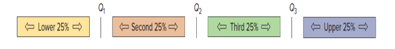

# 1. Overview of Business analytics
---
## 1.1 The Definition of Business Analytics
Business analytics is a process of gathering, inspecting, cleaning, transforming and modeling data. 
The goal of business analytics is gathering useful information to suggest conclusions and support decision making.

## 1.2 Business Analytics Skills:
1. Data cleaning
    - a process of detecting and correcting inaccurate and corrupt data, and removing unwanted data.

2. Explotary Data Analysis(EDA)
    - a process of recongnizing the data and make it easy to read and understand. 
    - EDA is used to adjust data types and deal with missing data. It can also detect outliers and anomalies.
    - it includes four steps: 1.Loading the Data; 2.Data Visualization; 3.Data Imputation; 4.Statistics Analysis.

3. Statistics
    - statistics is used to model complex problem in real world.
    - statistics takes two forms:
        - *Descriptive statistics* uses the data to provide descriptions of the population, either through charts, tables, or numerical calculations. It can generate accessible insights from otherwise uninterpreted data. 
        But it doesn't predict future. 
        E.X. variance, standard deviation, mean, median; skewness, kurtosis
        - *Inferential Statistics* : hypothesis testing, correlation coefficient, statistics significance.

4. Data Visualization
    - the representation of data in the form of charts, dashboards, etc.
    - The main goal of DV is to make it easier to identify patterns, trends and outliers in large data sets.

5. Programming

## 1.3 Types of Business Analytics
1. Descriptive——What has happend?
2. Predictive——What will happen?
3. Prescriptive——What can we do today to influence future outcomes?
    - Recognize what is going on, the likely forecast, and make decisions to achieve the best performance possible. 
    - Aims to determine the best possible decision. 
    - Uses both descriptive and predictive analytics to create alternatives, and then determines the best one.

# 2. Data
---
## 2.1 The Definition of Data
Data is raw facts, figures, measurements and amounts that we gather for analysis or reference, it  also includes descriptive information about things, plants, animals, and people.

## 2.2 Data Types
Two Data Types:
1. Structured data
Quantitative data, is used when   quantify a  problem or address the "what" or "how many" aspects  of a research question. 
It can divided into:
- Categorical
Can be put in groups or categories using names or labels
    - Nominal
    a type of categorical data in which objects fall into unordered categories (i.e., order is not important).
    - Ordinal
    ordinal data is a type of categorical data in which order is important.
    - Binary
    a type of categorical data in which there are only 2 categories
- Measurement
    - Discrete
    The object can be measured as quantitative data(numerical data), the resulting data is a set of numbers. 
    It can be discrete or continuou. 
    E.X. Cholesterol level, Weight, Height, Age, SAT score

    - Continuous

2. Unstructured/Semi-structed data
Qualitative data that describe qualities or characteristics.

- Textual

- Multimedia
    - Image
    - Audio
    - Video

- HTML/XML

# 3. Dataset
Dataset is an ordered collection of data, it can be a set of numbers or values that pertain to a specific topic. 
This set is normally presented in a tabular pattern.  
Every column describes a particular variable/attribute.  
Each row(exclude the header) corresponds to a data record/observation. 
 
In one dataset, we care about 2 things:
- Attributes/Variables
- Observations/Data records

>Tables
>the most commonly used structure to store data in a dataset.

# 4. Data Visualization
Data visualization enable us to explore the patterns in data, such as: 
- the presence of outliers
- distributions of individual variables
- relationships between groups of variables

Data Visualization has different types of Charts:
- Scatter Plot
- Histogram
- Line Chart
- Bar Chart
- Stacked Bar Chart
- Box Plot

## 4.1 Scatterplot
A scatterplot shows the relationship between **two numerical variables** plotted simultaneously along both the horizontal and vertical axis. 
A scatterplot is often used to understand data rather than to communicate with it.  
Scatter plots can convey patterns in data pairs that would not be apparent from a table. 

## 4.2 Histogram
A histogram is a bar chart (with no spaces between the columns) and a graphical representation of a frequency distribution(numerical data) . 
A histogram can make it easy to identify outliers within a given dataset. 

## 4.3 Line Chart
Line charts are used to show the relationship between two numerical variables, and display a time series, to spot trends, or to compare time periods. 
Line charts are best used when you want to show how the value of something changes over time. 

## 4.4 Bar Chart
A bar chart is a common chart type for graphing *categorical data or data sorted into groups*. 
A column chart is a vertical display of the data. 
A bar chart is a horizontal display of the data. 
Bar chatrs is often used to visualize visualize the frequency of different categories, or levels, of a single categorical variable, but it can also be used to visualize the joint distribution of two categorical variables at the same time. 

## 4.5 Stacked Bar Chart
A traditional bar chart displays a single categorical variable in the form of bars. 
A stacked bar chart shows two categorical variables.  
- The first (and primary) variable is shown along the entire length of the bar, and the second variable is represented as stacks within each categorical bar.

## 4.6 Box Plot
It is a dense display that aims to provide lots of context for any given dataset.  
The chart visually represents several summary metrics in a single view: minimum, maximum, median, lower quartileh, upper quartile. 
 

**Violin Plot**
- depicts distributions of numeric data for one or more groups using density curves. 
- The width of each curve corresponds with the approximate frequency of data points in each region. 

**Quantiles**
Quantiles (denoted Q1, Q2, Q3) are scale points that divide the sorted data into four groups.

Q2 is the median. 
IQR = Q3-Q1

# 5. Missing Data
Missing data: blank cells in your spreadsheet, or NA in R.

There are three types of missing data:
1. Missing completely at random (MCAR)
    Missing data are randomly distributed across the variable and unrelated to other variables. 
    Explanation: You have a dataset that contains missing values in every row of every variable.

2. Missing at random (MAR)
    Missing data are not randomly distributed but they are accounted for by other observed variables. 
    Explanation: Missing data in your dataset is only missing in 3 specific related variables.

3. Missing not at random (MNAR)
    Missing data systematically differ from the observed values. 
    Explanation: You have a dataset that contains missing values because participants refused to answer specific question
    
You can have 3 methods to deal with missing data:
- Acceptance: You leave your data as is.
- Deletion: You delete all cases (participants) with missing data from analyses.
- Imputation: You use other data to fill in the missing data.

    
    
    

    

        
